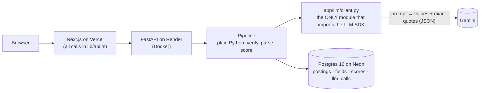
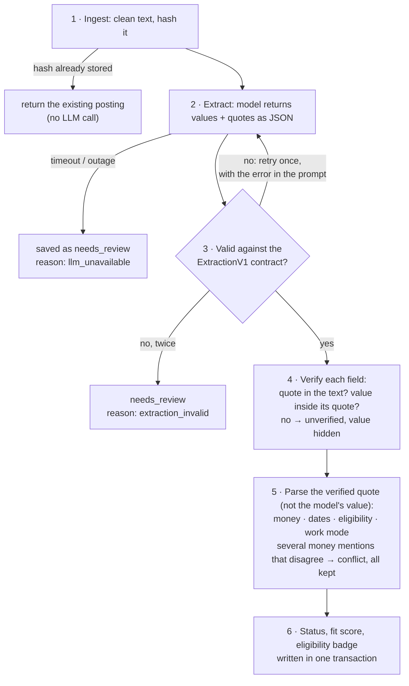

# JD Lens

**Paste a job posting; get verified fields and a fit score. Every value on screen is backed by an exact quote from the posting, checked by code.**

[](https://github.com/PratyusH-27-2005/JD-LENS/actions/workflows/ci.yml)

**Live:** https://jd-lens-ten.vercel.app · **API docs:** https://jd-lens-api.onrender.com/docs
(free hosting: the first request after 15 idle minutes takes ~30–60 s while the API wakes up)

<!-- 60-second demo GIF: record it, save as docs/demo.gif, then uncomment:

-->

Paste the Kasparro placement notice and JD Lens shows its stipend, `Rs. 25,00 Per Month`, **in red: `"25,00" is not a valid digit grouping`**. It doesn't guess 2,500 or 25,000. The CTC is split into ₹5–8 L cash + ESOP (₹10–16 L total), the deadline becomes 30 Sep 2026 09:00 IST (timezone marked as assumed), eligibility becomes CGPA ≥ 6.0 with no backlogs, and each of those is highlighted in the original text.

## 1. The rule: LLM as witness, code as judge

The model only reads the posting and returns each fact **with the exact span it came from**. Python checks that the span is really in the text and that the value sits inside it, parses every number from that verified span (never from the model's own value), and does all the scoring. Anything that fails a check is hidden or flagged, never shown as fact.



A test fails the build if any other module imports an LLM SDK ([tests/test_guard.py](backend/tests/test_guard.py)), so there's no side door around the checks.

## 2. What happens to a posting



- **Status:** company and role verified → `verified`; some field flagged → `partial`; otherwise `needs_review`.
- **Flags** a field can carry: `ambiguous` (didn't parse cleanly, reason shown), `conflict` (mentions disagree), `unverified` (quote not found: value hidden), `missing` (not stated).
- **Score (0–100):** skills 50 · location 20 · pay 30, from verified, unflagged fields only. A part with no verified input is left out and the others are rescaled; the UI says "on 2 of 3 parts". **Eligibility** (CGPA cutoff, backlogs, deadline) is a separate badge, and any unknown makes it "Check manually", never "Eligible".
- **Resume import:** upload a PDF on the profile page. Same rule: name, CGPA and skills come with quotes the code checks; the form is pre-filled for review, nothing is saved until you click Save.

## 3. Failure teardown: the Kasparro notice

<!-- TODO(Manav): write this section. Raw material, all real output: docs/teardown-material.md
     (the llm_calls row and flagged fields from the deployed database, and the first real
     run where attempt 1 failed validation and nearly produced a false CTC conflict). -->

_To be written._

## 4. Decisions and trade-offs

| Decision | Why | Cost |
|---|---|---|
| **Exact-substring evidence check**, folding only whitespace, curly quotes and dashes | A paraphrase can't pass as evidence | A correct field is occasionally rejected (in the eval: 0 of 102 quotes) |
| **The value must sit inside its own quote** | Otherwise a real quote could "verify" an invented value: `value: "₹ 25,000"`, `evidence: "Rs. 25,00 Per Month"` | A skill written differently from the posting (`PostgreSQL` vs `Postgres`) is dropped |
| **Numbers are parsed from the verified quote, never from the model's value** | The model is a witness; code is the judge | None worth noting |
| **Money fields are lists** | A posting can state the stipend twice, differently; we show the conflict instead of picking one | A model that splits one CTC sentence would create a false conflict (the prompt forbids it; the eval checks for it) |
| **Fail closed**: invalid JSON after one retry → `needs_review`, never partial values | No invented data, ever | An outage leaves postings to reprocess later |
| **Schemas are versioned contracts** (`extraction_v1`, `resume_v1`) stored with every result | A change means a new version, so old results stay explainable | More files |
| **Synchronous pipeline** inside `POST /postings` (5–20 s), LLM call outside any DB transaction | Simple; one transaction per result | No progress updates; a queue is the listed next step |
| **Rule-based score, eligibility as a separate badge** | Every point is explainable in the breakdown; "100 but not eligible" is a real, useful answer | Hand-written alias maps for skills and cities |
| **Rate limit keyed on Cloudflare's `CF-Connecting-IP`**, never `X-Forwarded-For` | The first deploy trusted `X-Forwarded-For`, and a fake header reset the limit; found and fixed on the live site ([NOTES.md](NOTES.md)) | Assumes Cloudflare in front (true on Render; a setting turns it off) |

## 5. Eval results

`python -m app.eval --runs 3` runs the real model on the [fixture postings](backend/tests/fixtures/postings) three times each and checks what the *code* decided: status, every field's flag, the parsed values, and the verified skill set. Expected outputs are written by hand from the posting text ([`*.expected.json`](backend/tests/fixtures/postings)), not copied from model output.

Model `gemini-2.5-flash`, prompt `extract_v1`, 30 Sep 2026. **98/99 checks passed.**

| Check | acme | kasparro | zeta |
|---|---|---|---|
| status | ✓ | ✓ | ✓ |
| company | ✓ | ✓ | ✓ |
| role_title | ✓ | ✓ | ✓ |
| location | ✓ | ✓ | ✗ 2/3 (value 'India') |
| work_mode | ✓ | ✓ | ✓ |
| stipend | ✓ | ✓ (flagged ambiguous, as expected) | ✓ |
| ctc | ✓ | ✓ | ✓ |
| eligibility | ✓ | ✓ | ✓ |
| application_deadline | ✓ | ✓ | ✓ |
| apply_instructions | ✓ | ✓ | ✓ |
| required_skills | ✓ | ✓ | ✓ |

- **Evidence rejection rate:** 0/102 quoted mentions were not found in the posting.
- **Retries:** 0/9 extractions needed the second attempt; none ended in `needs_review`. (The first draft of the prompt failed validation on its first real run; see the teardown.)
- **Latency per call:** median 7.2 s, max 19.6 s. **Tokens per call:** ~833 in, ~578 out.

**The one miss:** Zeta says `Location: Remote (India)`. In one run of three the model gave the location as "India" rather than "Remote". The quote was genuine and both readings are defensible, and the score is unaffected (work mode was correctly `remote`, which gets full location points). The expectation was left as written rather than loosened after seeing the result.

Three postings is a small sample: this shows the checks work end to end and are stable across runs, not a measured accuracy.

## 6. Known limitations

**LLM extraction**
- Latency is 5–20 s per call (eval: median 7.2 s, max 19.6 s), with a 30 s timeout. A timeout fails closed (`needs_review`, `llm_unavailable`) and can be reprocessed; only invalid output is retried automatically.
- Money mentions are reconciled per mention, so a model that splits one CTC sentence into "cash" and "total" halves would produce a false conflict. The prompt forbids it, the eval checks for it (0 in 9 runs), and `tests/pipeline/test_eval.py` proves the eval would catch it.
- `clean_text` keeps line breaks (spaces and blank lines are collapsed), so the model and the highlight see the posting's structure. Evidence spanning a line break still verifies because the check folds all whitespace.

**Evidence check**
- The value must also appear inside its own quote. That rejects a model that "fixes" `Rs. 25,00` to `₹ 25,000`, but also rejects a correct skill name written differently from the posting (name `PostgreSQL`, quote `Postgres`).
- Strict by design: only whitespace, curly quotes and dash characters are folded. A model that changes case, drops a word, or adds/removes a space *inside* a token (`Rs.25,00` vs `Rs. 25,00`) gets the field marked unverified. We'd rather lose a good field than show a paraphrase.

**Money**
- Rupees only; `$`, `USD` etc. are not recognised as currency.
- A stipend with two separate amounts ("₹20k for 3 months, then ₹25k") is flagged ambiguous, not modelled as a schedule.
- CTC with no period is assumed yearly (CTC is annual by definition); a monthly CTC is multiplied by 12.
- Cash vs total is decided by the word "total"/"overall" before an amount. Other phrasings ("fixed", "variable", "in-hand") aren't distinguished.
- Equity is detected by keyword (ESOP, equity, stock, RSU) only; its value is never parsed.

**Dates**
- No timezone → IST assumed (`tz_assumed: true`); no time → 23:59:59 assumed (`time_assumed: true`). Both are stored and shown.
- Numeric dates are read as DD/MM only when that's forced (day > 12); `05/10/2026` is flagged ambiguous.
- "Midnight" is flagged ambiguous; relative deadlines ("within 7 days") aren't parsed.
- Only IST, UTC and GMT are recognised as timezones.

**Eligibility and scoring**
- CGPA on a 10-point scale only; percentage cutoffs ("60% throughout") are not converted, so eligibility becomes "Check manually".
- "CGPA > 7" is treated as a minimum of 7 (strict vs non-strict inequality is not kept).
- Branch and graduation-year rules aren't checked yet (schema v2 extension).
- An unknown deadline doesn't block eligibility; the posting just can't be shown as Closed.
- Pay score uses CTC cash only. Internship-only postings with just a stipend get no pay score (the part is left out and weights rescale).
- A score rescales over the parts it could compute, so a posting with no listed skills can score 100 on location and pay alone. The UI shows the coverage ("on 2 of 3 parts") next to the number, but sorting by score doesn't break ties by coverage.
- Skill and city matching use small hand-written alias maps; anything not in them must match exactly (case-insensitive).
- "Virtual" is deliberately not read as remote: in placement notices it usually describes the recruitment drive, not the job.

**Resume import**
- PDF only, text layer only: scanned resumes are refused with a message (no OCR). Multi-column layouts can come out of pypdf in a jumbled order; quotes that span the jumble won't verify and are dropped, not guessed.
- The resume text goes to Gemini. On the free tier Google may use it to improve its products; the upload button says so. JD Lens stores neither the file nor the text, which also means resume extractions have no `llm_calls` trace.
- CGPA on a 10-point scale only; other scales are shown as rejected rather than converted.

**API, data and hosting**
- **No login.** The demo is public: anyone can add postings, import a resume and edit the single profile. The per-IP rate limits (10 postings and 5 resume imports per minute) protect the LLM quota, not the data.
- The rate limit is kept in memory, so it resets on restart and isn't shared between API instances. The client IP comes from Cloudflare's `CF-Connecting-IP` on Render (`TRUST_CF_CONNECTING_IP=true`), never from `X-Forwarded-For`. Deployed somewhere without Cloudflare, every client behind the same proxy would share one limit.
- The pipeline runs inside `POST /postings` (5–20 s). Fine for one user; a job queue with polling is the listed next step.
- "Closed" is computed from the deadline at read time, never stored, so the badge flips without a rescore.
- `GET /postings` returns everything, with no pagination; `PUT /profile` rescores every posting in one transaction. Fine for a personal tracker, not for thousands of rows.
- Free tiers: Render sleeps after 15 idle minutes, Neon scales to zero, Gemini has per-minute and per-day limits (over them, postings are saved as `needs_review` to reprocess later).

**Web app**
- No frontend tests yet: the pages were checked by hand in a browser (every state: loading, empty, API down, not found, validation, save). `lib/highlight.ts` mirrors the backend's folding rules but isn't unit-tested on its own.
- Data is fetched in the browser (client components), so the first paint is a skeleton.

## 7. Run locally and run tests

```bash
cp .env.example .env            # fill in LLM_API_KEY and DATABASE_URL
docker compose up -d db         # or use a Neon database: paste its connection string as-is
cd backend
pip install -e ".[dev]"
alembic upgrade head
uvicorn app.main:app --reload   # http://localhost:8000/docs

cd ../frontend                  # in a second terminal
npm install
npm run dev                     # http://localhost:3000
```

```bash
cd backend
ruff check . && ruff format --check .
pytest -q                            # all 243; the 35 API tests need TEST_DATABASE_URL
pytest -q tests/unit tests/pipeline  # fast: no database, no network, no LLM
python -m app.cli tests/fixtures/postings/kasparro.txt --raw   # one real extraction
python -m app.eval --runs 3          # the eval above (real LLM)
```

- **Tests** (243): 176 unit tests (evidence check, money, dates, eligibility, CGPA, scoring, PDF), 29 pipeline tests with a scripted `FakeLLMClient` (retry, fail closed, invented quotes, conflicts, eval logic), 35 API tests against a real Postgres (error shape, duplicates, rate limit, CORS, resume import), and the SDK guard. API tests use `TEST_DATABASE_URL`, a database whose name must end in `_test` because its tables are truncated; CI runs them against a Postgres 16 container.
- **CI** on every push: backend lint + tests, frontend lint + build, and a build of the API Docker image.
- **Deploy:** Render (API, Docker, Singapore) + Neon (Postgres) + Vercel (web), all free tiers, step by step in [docs/DEPLOY.md](docs/DEPLOY.md).

## Repo map

| Path | What |
|---|---|
| [docs/DESIGN.md](docs/DESIGN.md) | Design doc and build plan: principles, data model, pipeline, API |
| [backend/app/pipeline/](backend/app/pipeline) | The judge: `evidence.py`, `normalize/`, `scoring.py`, `run.py`, `llm_step.py` |
| [backend/app/llm/](backend/app/llm) | The witness: `client.py` (only SDK import), versioned prompts |
| [backend/app/schemas/](backend/app/schemas) | LLM contracts (`extraction_v1`, `resume_v1`) and API models |
| [frontend/](frontend) | Next.js app: dashboard, paste, detail with highlighted evidence, profile |
| [NOTES.md](NOTES.md) | Bugs that took real digging, including the rate-limit bypass found on the live deploy |

**Next** (not built): background processing with a job queue; running two models on the same posting and showing where they disagree; schema v2 with branch and graduation-year rules; deadline reminders; OCR for scanned PDFs.
